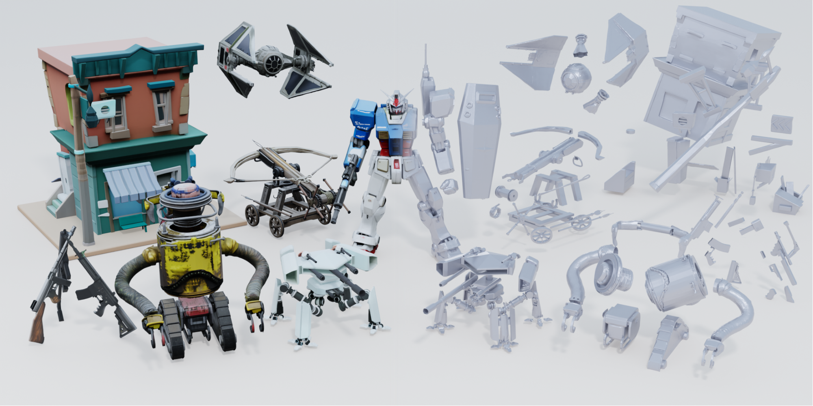

<div align="center">

# FullPart: Generating each 3D Part at Full Resolution
## [arXiv Preprint](https://arxiv.org/abs/2510.26140) | [Project](https://fullpart3d.github.io) | [Dataset](https://huggingface.co/datasets/dscdyc/partversexl) | [Demo (Coming)]()

</div>



We present a new part-based 3D generation framework *FullPart* that combines both implicit and explicit paradigms. 

<!--  -->

And we introduce the largest and most comprehensively annotated 3D part dataset [*PartVerse-XL*](https://huggingface.co/datasets/dscdyc/partversexl), an upgraded version of [*PartVerse*](https://copart3d.github.io/), from 12K/91K to 40K/320K objects/parts. 


## 🔨 Installation
1. Clone the repo:
      ```bash
      git clone https://github.com/hkdsc/fullpart.git
      cd src/submodule/TRELLIS
      ```

2. Follow the [*TRELLIS*](https://github.com/microsoft/TRELLIS) repo to install the basic dependencies:
    
      **Before running the following command there are somethings to note:**
      - By adding `--new-env`, a new conda environment named `fullpart` will be created. If you want to use an existing conda environment, please remove this flag.
      - By default the `fullpart` environment will use pytorch 2.4.0 with CUDA 11.8. If you want to use a different version of CUDA (e.g., if you have CUDA Toolkit 12.2 installed and do not want to install another 11.8 version for submodule compilation), you can remove the `--new-env` flag and manually install the required dependencies. Refer to [PyTorch](https://pytorch.org/get-started/previous-versions/) for the installation command.
      - If you have multiple CUDA Toolkit versions installed, `PATH` should be set to the correct version before running the command. For example, if you have CUDA Toolkit 11.8 and 12.2 installed, you should run `export PATH=/usr/local/cuda-11.8/bin:$PATH` before running the command.
      - By default, the code uses the `flash-attn` backend for attention. For GPUs do not support `flash-attn` (e.g., NVIDIA V100), you can remove the `--flash-attn` flag to install `xformers` only and set the `ATTN_BACKEND` environment variable to `xformers` before running the code. See the [Minimal Example](#minimal-example) for more details.
      - The installation may take a while due to the large number of dependencies. Please be patient. If you encounter any issues, you can try to install the dependencies one by one, specifying one flag at a time.
      - If you encounter any issues during the installation, feel free to open an issue or contact us.

      Create a new conda environment named `fullpart` and install the dependencies:
      ```sh
      . ./setup.sh --new-env --basic --xformers --flash-attn --diffoctreerast --spconv --mipgaussian --kaolin --nvdiffrast
      ```
      The detailed usage of `setup.sh` can be found by running `. ./setup.sh --help`.
      ```sh
      Usage: setup.sh [OPTIONS]
      Options:
            -h, --help              Display this help message
            --new-env               Create a new conda environment
            --basic                 Install basic dependencies
            --train                 Install training dependencies
            --xformers              Install xformers
            --flash-attn            Install flash-attn
            --diffoctreerast        Install diffoctreerast
            --spconv                Install spconv
            --mipgaussian           Install mip-splatting
            --kaolin                Install kaolin
            --nvdiffrast            Install nvdiffrast
            --demo                  Install all dependencies for demo
      ```
3. Install other dependencies:
      ```bash
      cd ../../..
      pip install -r requirements.txt
      ```

## 🔀 Pretrained Models
The pretrained models will be uploaded [here](https://drive.google.com/drive/folders/1iSgDC-vnN4JlzLyEHzJ1vsd8jUlTQ9rN?usp=sharing) before Nov 12th.

## 📦 Data
1. Download the [PartVerse](https://huggingface.co/datasets/dscdyc/partverse)/[PartVerse-XL](https://huggingface.co/datasets/dscdyc/partversexl) (12K/40K objects with 91K/320K parts) from HuggingFace. We have uploaded the initial dataset and are actively working on adding more.
The data directory after decompressing the dataset should be as follows:
      ```
      dataset/
      ├── textured_part_glbs/  
      ├── normalized_glbs/    
      ├── anno_infos/    
      ├── text_captions.json  
      ├── train.csv
      ├── val.csv
      └── metadata.csv
      ```
      - `textureld_part_glbs` contains textured 3D meshes for each decomposed part of the objects. Each file is stored in the GLB format.
      - `normalized_glbs` provides the complete, normalized 3D mesh of each object in GLB format. These are aligned with the part-level meshes and can be used for holistic shape analysis or comparison.
      - `anno_infos` provides files that can be used for generating auxiliary information of parts.
      - `text_captions.json` stores descriptive text captions for each part, automatically generated using a Vision-Language Model (VLM).
      - `train.csv` instance_id for train.
      - `val.csv` instance_id for eval.
      - `metadata.csv` metadata for Objaverse XL.

2. Preprocess

      Due to the large number of parts in some objects, we can discard some unimportant parts (such as a screw, etc.). We provide `partverse/get_infos.py` to process the data. By running it, you can obtain (1) some statistical information of the parts, (2) the priority of discarding them, (3) view of max overlap between full object and parts render. 
      ```
      python partverse/get_infos.py --data_root ${DATA_PATH} --global_info_save_path ${SAVE_PATH} --max_visible_info_save_path ${SAVE_PATH}
      ```

3. Rendering

      We provide rendering script following [*TRELLIS*](https://github.com/microsoft/TRELLIS). You can use `partverse/render_parts.py` to render `textured_part_glbs` (part objects) and `partverse/render_dir.py` to render `normalized_glbs` (whole objects), e.g.,
      ```python
      # rendering the parts
      python partverse/render_parts.py --textured_part_glbs_root ${DATA_ROOT}/textured_part_glbs --out_dir ${DATA_ROOT}/textured_part_renders --num_views 150 --use_random_views --save_mesh
      # rendering the full objects
      python partverse/render_dir.py --input_dir ${DATA_ROOT}/normalized_glbs --output_dir ${DATA_ROOT}/textured_mesh_renders --num_views 150 --use_random_views --save_mesh
      # rendering the condition images
      python partverse/render_dir.py --input_dir ${DATA_ROOT}/normalized_glbs --output_dir ${DATA_ROOT}/renders_cond --num_views 24 --use_random_views
      ```

4. Extract latents
      
      We provide `partverse/encode_latents_from_imgs.py` to get slat latents following *TRELLIS*,
      ```
      # encoding the full object renders
      python partverse/encode_latents_from_imgs.py --data_root ${DATA_PATH} --mode full
      # encoding the part renders
      python partverse/encode_latents_from_imgs.py --data_root ${DATA_PATH} --mode part
      ```

5. Caption (optional)

      In addition, we also provide text caption code to facilitate users in customizing text prompts for their own models. For the VLM, we use [Qwen2.5-VL-32B](https://huggingface.co/Qwen/Qwen2.5-VL-32B-Instruct) now. You can replace to any VLM.
      ```
      # rendering the reference images for captioning
      python partverse/render_parts.py --textured_part_glbs_root ${PART_GLB_PATH} --out_dir ${OUT_PATH} --num_views 8 --elevation 30
      # then generating text captions
      python partverse/get_text_caption.py --raw_img_root ${FULL_OBJECT_IMG_PATH} --part_img_root ${PART_IMG_PATH} --info_file ${MAX_VIS_INFO_PATH} --output_file ${OUT_PATH} --vlm_ckpt_dir ${VLM_HF_DOWN_PATH}
      ```

## 🤖 Train


### Sparse Structure Stage (S1)
Edit the config file in `src/configs/train_configs/personal_configs_part.py` to set the required paths.

```python
# personal_configs_part.py
// ...existing code...
train_dataset_csv_path = '{DATA_ROOT}/train.csv'
eval_dataset_csv_path = '{DATA_ROOT}/val.csv'
resume_ckpt_path = 'pretrained_model/{RESUME_CKPT_PATH}'
ss_flow_weights_dir = 'pretrained_models/trellis/ckpts'
part_dir='{DATA_ROOT}/anno_infos'
part_cond_dir='{DATA_ROOT}/renders_cond'
part_slat_dir='{DATA_ROOT}/textured_part_latents/dinov2_vitl14_reg_slat_enc_swin8_B_64l8_fp16'
global_slat_dir='{DATA_ROOT}/textured_mesh_latents/dinov2_vitl14_reg_slat_enc_swin8_B_64l8_fp16'
// ...existing code...
```

Then run the training script:

```bash
bash part_train.sh
```

### Refinement Stage (S2)
Edit the config file in `src/configs/train_configs/personal_configs_part_stage2.py` to set the required paths.

```python
# personal_configs_part_stage2.py
// ...existing code...
train_dataset_csv_path = '{DATA_ROOT}/train.csv'
eval_dataset_csv_path = '{DATA_ROOT}/val.csv'
resume_ckpt_path = 'pretrained_model/{RESUME_CKPT_PATH}'
ss_flow_weights_dir = 'pretrained_models/trellis/ckpts'
part_dir='{DATA_ROOT}/anno_infos'
part_cond_dir='{DATA_ROOT}/{RENDERS_COND}'
// ...existing code...
```

Then run the training script:

```bash
bash part_train_s2.sh
```

Additionally, we are currently working on integrating vecset diffusion into this repository, as it was originally trained on a different framework.

## 🔮 Inference

Run the following command:
```bash
python inference.py \
	--stage1.transformer-ckpt pretrained_models/{S1_CKPT_PATH} \
	--stage2.transformer-ckpt pretrained_models/{S2_CKPT_PATH} \
	--raw-image {MY_IMAGE_PATH} \
	--raw-box {MY_BOXES_PATH} \
	--raw-sample_id {MY_SAMPLE_ID} \
	--output-dir {OUT_PATH}
```

## 📖 Citation
```bibtex
@misc{ding2025fullpart,
      title={FullPart: Generating each 3D Part at Full Resolution}, 
      author={Lihe Ding and Shaocong Dong and Yaokun Li and Chenjian Gao and Xiao Chen and Rui Han and Yihao Kuang and Hong Zhang and Bo Huang and Zhanpeng Huang and Zibin Wang and Dan Xu and Tianfan Xue},
      year={2025},
      eprint={2510.26140},
      archivePrefix={arXiv},
}
```
